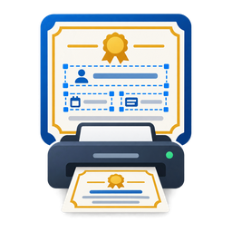

  

<h1 align="center">Certificate Printer</h1>

  Print names, dates and details neatly onto your ready-made certificates. 
  <a href="../../releases/latest"><strong>Download the latest version</strong></a>

---

Have a stack of printed certificates with blank lines waiting to be filled in? Certificate Printer fills them
for you. Show the app what your certificate looks like, mark where each name or date should go, then type the
details and print. Only your text is printed, exactly on the lines, so the certificate's own design stays untouched.

It's ideal for churches, schools, training centres, clubs and offices that hand out baptism, membership,
completion or award certificates.

## What you can do

- **Set it up once, reuse it forever.** Take a photo or scan of your blank certificate and turn it into a
  template. Next time, just pick the template and fill in the details.
- **Place text exactly where you want it.** Drag boxes for the name, date, course or anything else onto the
  picture of your certificate. Helpful guide lines snap everything into neat alignment, and you can zoom in
  for fine adjustments.
- **Beautiful lettering.** Choose from 12 included fonts, from elegant handwriting styles to classic and formal
  lettering, or use any font already on your computer. Long names shrink automatically to fit the space.
- **Works with any paper size.** A4, A3, A5, Letter, Legal, upright or sideways, or your own custom size.
- **Print with confidence.** Print to any printer, or save a PDF to check first. Save a PDF that
  includes the certificate design too, ready to email.
- **Printer a little off?** If your printer places text slightly too high or to one side, nudge it once in the
  template and every future print is corrected.
- **Never retype a name.** Every certificate you print is kept in a searchable history. Find a past one by
  name, date or template and reprint it in one click.
- **Looks right on any screen.** What you design is what prints, whatever the size of your monitor.
- **Light and dark mode.** The app follows your computer's appearance setting.
- **Works offline.** No internet connection or account needed. Your templates and records stay on your computer.
- **Stays up to date.** The app lets you know when a new version is ready, shows what's new, and installs it
  with one click.

## Download and install

Go to the [latest release](../../releases/latest) and, under **Assets**, download the file for your computer.

### Windows

1. Download `CertificatePrinter-Setup-<version>.exe`.
2. Open it. Windows may show a blue **"Windows protected your PC"** message because the app is new. Click
   **More info**, then **Run anyway**.
3. Follow the installer. A **Certificate Printer** shortcut is added to your desktop and Start menu.

### Mac

1. Download the `.dmg` file (when a Mac version is listed under **Assets**).
2. Open it and drag **Certificate Printer** into **Applications**.
3. The first time, macOS may say it can't verify the app. Open **System Settings → Privacy & Security**,
   scroll down and click **Open Anyway**. You only need to do this once.

## Free trial and activation

Every new installation works fully for **7 days**. To keep using it after that:

1. Open the **License** page in the app. It shows a short **machine code** for your computer.
2. Send the machine code to us (details below).
3. We send you an **activation code**. Paste it into the app and click **Activate**.

The activation is tied to that one computer. If you move to a new computer, just send us its new machine code.

## Updates

When a new version is available, the app shows a short summary of what's new.

- Most updates are **optional**. Choose **Update now**, **Later**, or **Skip this version**.
- Occasionally an update is **required** (for example an important fix). The app then downloads it
  automatically and asks you to restart.

On a Mac, the app gives you a **Download update** button. Install the new version the same way as the
first time.

## Need help?

Certificate Printer is made by **Arsi Consultancy**.

- Email: [contact@arsi.in](mailto:contact@arsi.in)
- Website: [arsi.in](https://arsi.in)

Send us your machine code to activate, or get in touch if anything doesn't print the way you expect.
